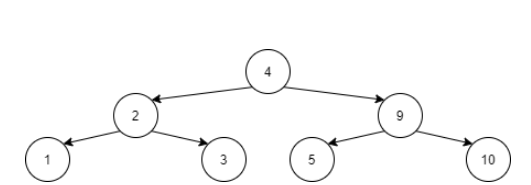

# Algorithms-Course-problem-solving

## Problem #1 String Generation

Given M strings you are required to find the count of all strings of length N that contain at least K strings from the M strings as substrings. You are required to answer the question above using brute force implemented using recursion.

**Input Format**

The first line will contain M, N, and K in this exact order.
The next M lines will contain a string each

**Constraints**

1 <= M <= 7

1 <= N <= 7

1 <= K <= M

1 <= Length of the M strings <= N

All strings will contain capital letters between A and E inclusive.
Output Format

The number of strings satisfying the condition.

**Sample Input 0**

2 3 1

AE

AD

**Sample Output 0**

20

**Explanation 0**

The strings satisfying the condition are: AAD, AAE, ADA, ADB, ADC, ADD, ADE, AEA, AEB, AEC, AED, AEE, BAD, BAE, CAD, CAE, DAD, DAE, EAD, EAE

**Sample Input 1**

2 3 2

AD

AEC

**Sample Output 1**

0

## Problem #2 Strings difference

You are required to output all the binary strings with length N and have excatly H ones in a lexicographical order

**Input Format**

The first line of the input contains N, the length of the bit strings and H, the number of ones

**Constraints**

1 ≤ H ≤ N ≤ 16.

**Output Format**

print a list of all possible bit strings of length N each on a seperate line, every string should have H ones printed. the strings should be sorted lexicographically* *https://stackoverflow.com/questions/45950646/what-is-lexicographical-order/45950665

**Sample Input 0**

4 2

**Sample Output 0**

0011

0101

0110

1001

1010

1100

## Problem #3 Arithmetic expression 1

Given 5 numbers, find out if you can place the arithmetic operators {+, −, ∗} between them to create an arithmetic expression yielding to the value 27. Note that you can arrange the number in any arrangement(Hint: use next_permutation) so if the numbers given are 1 2 3 4 5 you can place the operators 1 + 2 + 3 * 4 - 5 or 5 * 2 + 3 - 1 * 4 also consider the +, -, * have the same precedence so just consider the calculation in a sequential way. for example here 1 + 2 + 3 * 4 - 5 --> ((((1 + 2) + 3) * 4) - 5) so you will do the first addition and then the second, then the multiplication then the subtraction so don't consider the * to have higher precedence

**Input Format**

The Input consists of 5 of positive Integers, each between 1 and 50.

**Constraints**

see input format

**Output Format**

Print ‘Possible’ (without quotes) if there exists an arithmetic expression, Otherwise print ‘Impossible’

**Sample Input 0**

42 8 2 32 37

**Sample Output 0**

Possible

## Problem #4 String re-arrangement

You will be given N strings containing lower case English letters. In one move you can choose a string i and move the first letter from the start of the string to the end of the string. For example, if he has the string "abcdef", in one move he can transform it into the string "bcdefa".

What is the minimum number of moves you need to make the strings identical if possible

**Input Format**

The first line contains integer n — the number of strings.

This is followed by n lines which contain a string each. Lengths of strings are equal.

**Constraints**

(1 ≤ n ≤ 50) Lengths of each string is positive and don't exceed 50.

**Output Format**

Print the minimal number of moves you need in order to make all the strings identical or print  - 1 if there is no solution.

**Sample Input 0**

4

xzzwo

zwoxz

zzwox

xzzwo

**Sample Output 0**

5

**Sample Input 1**

3

aa

aa

ab

**Sample Output 1**

-1

## Problem #5 Train Breaking

There is a train with **N** cars connected to each other using connectors. Assume: the connector location 1 is between the first and second cars. You are given a **sorted** list **L** of connector locations, and required to find the order of locations to break the train at all the specified locations in L while getting the minimum total cost. Breaking a train of length x costs x. You are required to answer the question above using dynamic programming.

**Input Format**

The first line contains the number of train cars N

The second line contains the number of required breaks M (the list size)

The third line contains M integers representing the locations of the required breaks

**Constraints**

1 ≤ N ≤ 10^5

0 ≤ M < N

0 ≤ M < 10^4

1 ≤ L[i] < N

L is given sorted ascendingly

**Output Format**

One line containing the minimum possible cost to break the train at all the specified locations

**Sample Input 0**

20

3

4 10 12

**Sample Output 0**

40

**Explanation 0**

If we break the train from left to right, the first break will cost 20, the second break will cost 16 and the third break will cost 10, for a total of 46.

If we break the train from right to left, the first break will cost 20, the second break will cost 12 and the third break will cost 10, for a total of 42.

The optimal solution is to start by breaking the train at location 10 (costing 20), then break the train at 4 (costing 10), then we break the train at 12 (costing 10), with a total cost of 40.

## Problem #6 Balls

If you have two balls, one of size **A** and the other of size **B.** B is greater than **A.** You are required to use as many balls as possible of each type to reach a total size, **S.** Ball B is cheaper than ball A, so if you found more than one solution, choose the solution that has more of ball B, but the first priority is to try to reach the total size S as much as possible. You are required to find how many balls of type A and type B are needed to reach the total size S and the minimum remaining size.

Take care that the memory constraint is small so memory allocation is not advised.

**Input Format**

One line containing S, A, B

**Constraints**

0 < S, A, B <= 10^8

A < B

**Output Format**

One line containing: i) the needed number of A balls, ii) the needed number of B balls, and iii) the minimum remaining size.

**Sample Input 0**

24 3 5

**Sample Output 0**

3 3 0

**Explanation 0**

Note that if we took 4 balls of type B (the maximum possible number of it) and 1 ball of type A, we will get 20 + 3 = 23 with 1 remaining size. This is not the optimal solution, because there is an optimal solution (3 of A and 3 of B) that will have less remaining size (0).

**Sample Input 1**

50 3 9

**Sample Output 1**

1 5 2

## Problem #6 Robots

In multi-robot task allocation, there are a set of tasks and a set of robots, and the target is to assign robots to tasks. However, there are some constraints that complicate the allocation process. The ordering constraints, for example, specify which tasks must be performed before some other tasks. If task T1 precedes task T2, this means that T1 must be performed first before performing T2.

Assume that we have **N** tasks, and each task Ti has **two** preceding tasks (the two tasks must be executed before Ti). You are required to print all tasks in the order of execution (the one that executed first is printed first). For some tasks, we may not know all the tasks that precede it. There are multiple solutions for that problem. To get a similar solution to HackerRank, when implementing your algorithm iterate on task 0 first.

**Use an adjacency list to represent the graph.**

**Input Format**

The first line contains the integer N.

For the next N lines,

Each line represents the preceding tasks of one task starting from task with index 0 (the first line) to task with index N-1 (the last line)

Each line contains two numbers representing the indices of the two preceding tasks of the current task.

If any preceding task is unknown a -1 is present.

**Constraints**

1 <= N <= 10^6

**Output Format**

One line containing the indices of all tasks in the order of execution.

**Sample Input 0**

9

-1 -1

0 -1

1 3

0 6

-1 -1

-1 -1

-1 5

-1 -1

7 6

**Sample Output 0**

7 5 6 8 4 0 3 1 2

## Problem #3 Obstacles Game

In a 2D game grid, the start cell is the top left corner, and the end cell is the bottom right corner. The grid has obstacles that the player cannot move on. The player is required to move from the start cell to the end cell while avoiding the obstacles such that the two allowed moving direction is either right or down. Grid cells with value -1 mean obstacles, and 0 mean normal cells. It is required to use **dynamic programming** to count the number of ways the player can move from the start cell to the end cell while avoiding the obstacles.

**Input Format**

The first line contains the number of rows R and the number of columns C

For R Lines:

Number of C values are entered in each line representing the values of that row (0 for empty cells, -1 for obstacle cells)

**Constraints**

1 <= R <= 10^3

1 <= C <= 10^3

The start cell and the end cell will be contain obstacles

**Output Format**

one value containing the number of ways the player can move from the start cell to the end cell while avoiding the obstacles.

**Sample Input 0**

4 4

0 0 0 0 

0 -1 0 0 

-1 0 0 0 

0 0 0 0

**Sample Output 0**

4

## Problem #4 Gold Collector

A robot working as a gold collector ewas put on a grid-shaped piece of land of size NxM. The robot is only allowed to move down, right, and down-right in this grid. At each cell in the grid there is an integer indicating the number of gold pieces at this cell. The robot is required to move from cell (0,0) to cell (N-1, M-1) while collecting the maximum number of gold piecec. Help the robot find this maximum number (using dynamic programming).

**Input Format**

The first line will contain the grid dimensions N and M space-separated.

The following N lines will contain M space-separated values each; representing the values for all grid locations.

**Constraints**

1 ≤ N ≤ 10^3

1 ≤ M ≤ 10^3

For each grid location, the value vi,j: -10^10 ≤ vi,j ≤ 10^10

**Output Format**

One integer indicating the maximum sum of values in the path.

**Sample Input 0**

4 3

1 6 15

4 -7 -5

-2 5 -7

2 7 9

**Sample Output 0**

26

## Problem #5 Maximum Sum 0

Given a tree (not a binary tree), where each node in the tree has an integer value. You are required to find the maximum sum for values of nodes under the constraint that the sum **cannot contain both a node and its parent** node. Describe an algorithm that **maximizes the sum of values** of the selected nodes in the tree.

Hint: the node structure will hold a vector of **node** pointers representing the **children** and two additional integers; one for the **value** and another for the **index** of the node and a pointer to **parent** node (optional).

**Input Format**

The first line will contain the number of nodes in the tree N.

The following N space-separated numbers will contain the data in each node.

The following N-1 lines represents edges and will contain 2 values each:

Index of the parent.

Index of the child.

**Constraints**

1 ≤ N ≤ 10^5

For each value vi: 1 ≤ vi ≤ 10^8

**Output Format**

The sum of values of the selected nodes.

**Sample Input 0**

8

4 2 3 60 4 15 5 10

0 1

0 2

0 3

1 4

1 5

3 6

3 7

**Sample Output 0**

82

**Explanation 0**

The selected nodes to maximize the sum are highlighted in the following figure:

## Problem #6 Gamer planning

A gamer has a set of challenges he wants to play. There is a **deadline** for each challenge, along with a **penalty** charged if the challenge was played after the deadline. Each challenge takes one unit of time only.

Given a set of challenges, we want to make a **timetable** detailing the order in which to play these chlallenges. The first challenge in the timetable begins at time 0 and finishes at time 1, the second challenge begins at time 1 and finishes at time 2, and so on.

For the given set of challenge, we want to find a timetable that **minimizes the total penalty** acquired for missing the challenges' deadlines. You are required to answer the question above using a **greedy algorithm.**

**Input Format**

The first line will contain N, which is the number of challenges.

The second line will contain N space-separated integers representing the deadlines d0 d1 d2 … dN-1 of each challenge.

The third line will contain N space-separated integers representing the penalties p0 p1 p2 … pN-1 incurred. If the challenge ai is not finished by the time di of each challenge, we incur a penalty pi.

**Constraints**

1 ≤ N ≤ 10^5

For each value vi: 1 ≤ vi ≤ 10^8

**Output Format**

The sum of values of the selected nodes.

**Sample Input 0**

7

6 1 4 3 2 4 4

10 30 50 40 60 20 70

**Sample Output 0**

50

## Problem #7 Arithmetic Series Subsequences

Given an array of size N and a difference D, output the count of subsequences of sizes M forming an arithmetic series with difference D. Use hash tables to implement your solution. You are allowed to use unordered_map and unordered_set if needed.

**Input Format**

One line containing N, and D, M

One line containing the elements of the array

**Constraints**

N is between 3 and 10^7.

D is between 1 and 1000

M is either 2 or 3.

Array elements are between 1 and 100000

**Output Format**

The count of subsequences of size M in one line

**Sample Input 0**

5 2 3

1 1 3 3 5

**Sample Output 0**

4

**Explanation 0**

Here the only subsequence of size 3 and difference 2 is (1,3,5). Any of the 1s can be chosen, and any of the 3s can be chosen and only 5 can be the last element. So the count of subsequence of size 3 is 2*2*1 = 4.

**Sample Input 1**

6 2 2

1 1 2 2 4 6

**Sample Output 1**

3

**Explanation 1**

Here the subsequences of size 2 and difference 2 are (2,4) and (4,6). There are 2 ways to generate (2,4) and there is 1 way to generate 4,6. The output is 3 (1+2).

## Problem #8 Encryption Key

An encryption key is hidden in a binary tree. The key is the concatenation of sums of selected levels of the tree. The selected levels start at level 0 (root level) and continues down the tree by K steps every time. For a tree with 9 levels, if K=3, the selected levels will be 0, 3, 6. K is the minimum value of the Lth level % the tree height. L is the value of the root % the tree height. You are allowed to use unordered_map and unordered_set if needed. If K is 0, set to 1 instead.

**Input Format**

The first line will contain the number of nodes in the tree N.

The following N numbers will contain the data in each node.

The next line will contain the number of edges in the tree E.

The following E lines will contain 3 values:

L or R to represent if this is a left or right child

Index of the parent.

Index of the child.

**Constraints**

N is between 1 and 10^6

Node 0 is always the root

Root is in level 0

Node values are between 1 and 10^4

**Output Format**

The concatenation of the sums in one line.

**Sample Input 0**

7

4 2 9 1 3 5 10

6

L 0 1

R 0 2

L 1 3

R 1 4

L 2 5

R 2 6

**Sample Output 0*

419

**Explanation 0**

L is equal to 4 % 3 which is 1. K is the minimum of the 1st level % tree height which is 2 % 3 which is 2. The selected levels are level 0 (with sum 4) and level 2 with sum (19)

## Problem #9 Nested Binary Search Trees

A binary search tree consists of nodes having the following data: a department key and a pointer to another binary search tree. The secondary binary search tree nodes contain ids of type integer. The nested binary search tree allows duplicate department keys, but does not allow duplicate pairs of department key and id. This means that there are no two elements containing the same department key and the same id. Given N pairs (department key and id) create the nested BST without balancing. You will then be given Q queries. For each query, print the number of nodes visited, and whether you found the query.

**Input Format**

The first line will contain the number of entries N and Q.

The following N lines will contain two numbers each, department key and id to add.

The following Q lines will contain two numbers, department key and id to search for.

**Constraints**

N is between 1 and 10^5

Department key and ids are between 0 and 10^5

Q is between 1 and 100

**Output Format**

Q lines each line containing the number of nodes visited and 1 if the entry is found or 0 if the entry is not found.

**Sample Input 0**

10 4

1 5

1 7

2 3

1 4

2 6

3 3

1 3

2 5

2 10

1 100

1 4

2 90

3 3

4 5

**Sample Output 0**

3 1

5 0

4 1

3 0

**Explanation 0**

You will create the following 4 trees, one main tree and one for each department key value. For each query trace the number of visited nodes and whether or not it was found.

## Contributors

[Donia Gameel](https://github.com/DoniaGameel).
